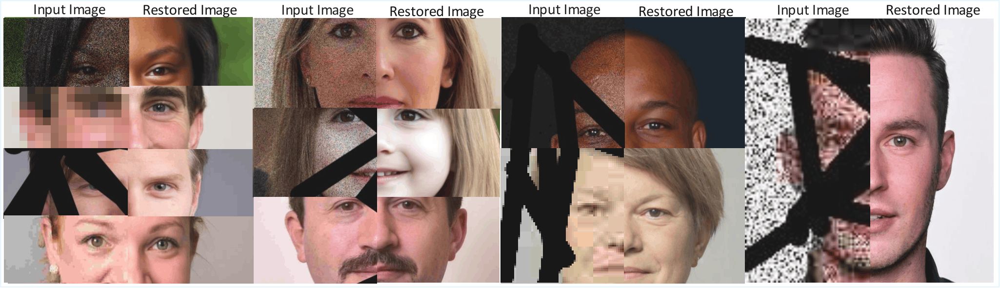

# GenR: Generative Latent Inversion for Blind Face Restoration
<p align="center">
  
</p>
GenR is an unsupervised StyleGAN3-based image restoration framework that restores severely degraded facial images without requiring paired training data. The framework progressively optimizes the latent representation from **W → W+ → W++**, allowing the generator to first reconstruct global facial structure and then progressively recover fine details. A multiscale perceptual–structural objective further improves restoration quality under challenging degradations.

---

## Features

- StyleGAN3-based blind face restoration
- Progressive latent optimization
  - W space
  - W+ space
  - W++ space
- Multi-start latent initialization
- Multiscale perceptual–structural loss
- Frequency-aware latent regularization
- Symmetric LPIPS loss
- Style Mixing
- Supports multiple restoration tasks
- Composite degradation restoration

---

## Supported Restoration Tasks

GenR supports

- Image Denoising
- Image Super-Resolution
- Image Inpainting
- JPEG Artifact Removal
- Composite Restoration

---

## Installation

GenR follows the same software environment as StyleGAN2 ADA 

### 1. Install StyleGAN Environment

First install the same environment as

https://github.com/NVlabs/stylegan2-ada-pytorch

The custom CUDA kernels are optional but provide faster execution.

---

### 2. Install Dependencies

```bash
pip install tyro
pip install torchmetrics
pip install lpips
pip install facenet-pytorch
pip install pytorch-msssim
pip install timm
pip install git+https://github.com/jwblangley/pytorch-fid.git
```

---

### 3. Download StyleGAN3 Model

```bash
mkdir pretrained_networks
```

Download [stylegan3 pretrained models](https://catalog.ngc.nvidia.com/orgs/nvidia/research/models/stylegan3/-/file-browser)   (ex. stylegan3-r-ffhqu-1024x1024.pkl)

and place it inside

```
pretrained_networks/
```

---


## Running GenR

Restore all images

```bash
python run.py --dataset_path datasets/samples
```


---


## Citation

If you find this work useful, please cite

```bibtex
@article{ali2026genr,
  title={GenR: Generative latent inversion for blind face restoration},
  author={Ali, Akbar and Mastan, Indra Deep and Raman, Shanmuganathan},
  journal={Pattern Recognition Letters},
  year={2026},
  publisher={Elsevier}
}
```

---

## Acknowledgements

This repository is built upon

- StyleGAN3
- Robust Unsupervised StyleGAN Image Restoration (CVPR 2023)

We thank the original authors for making their implementations publicly available.
